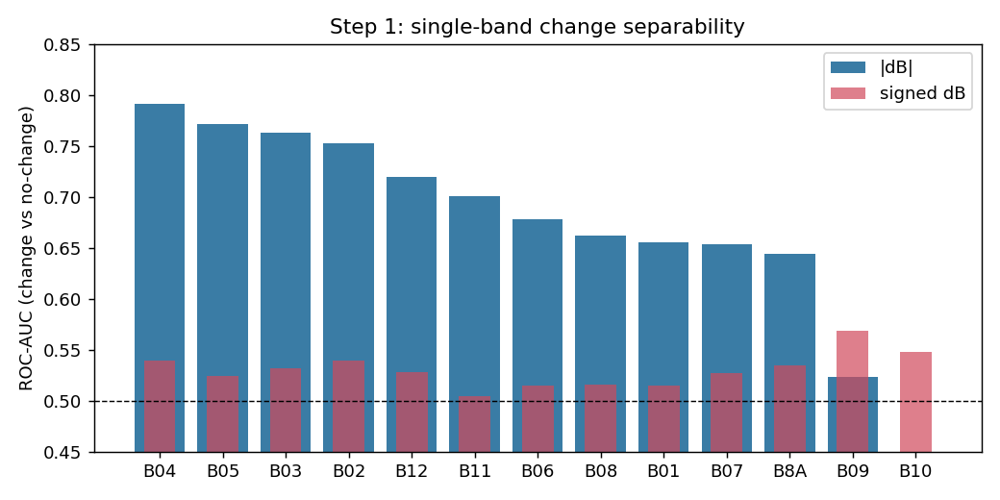
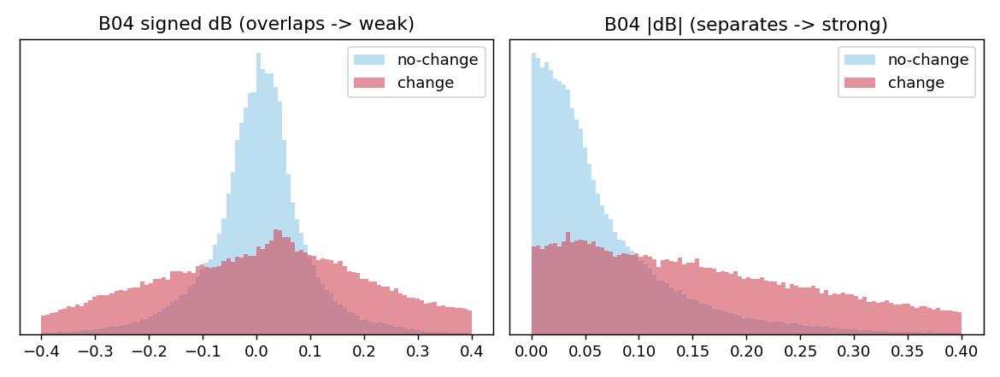
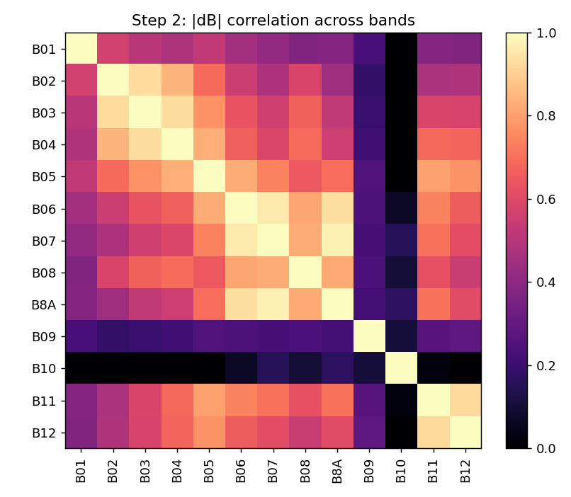
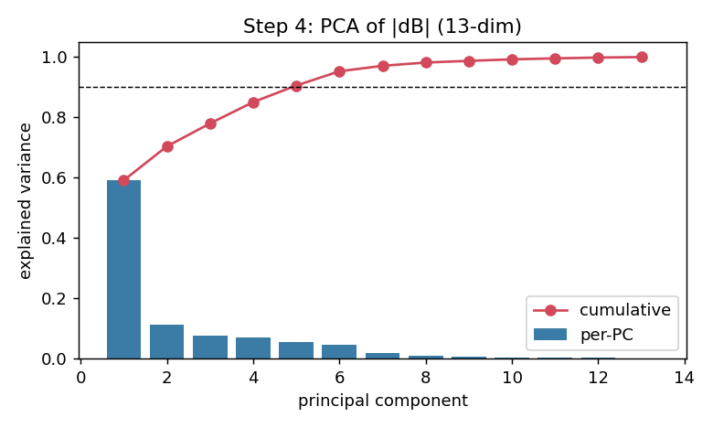
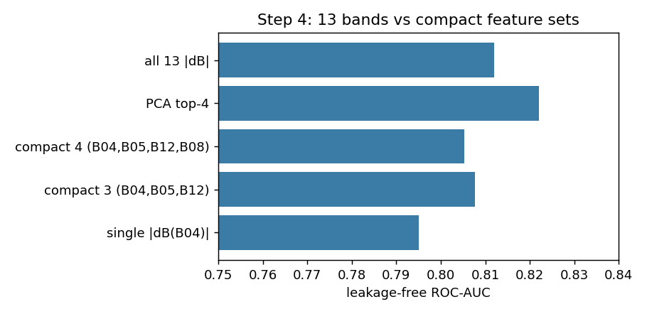
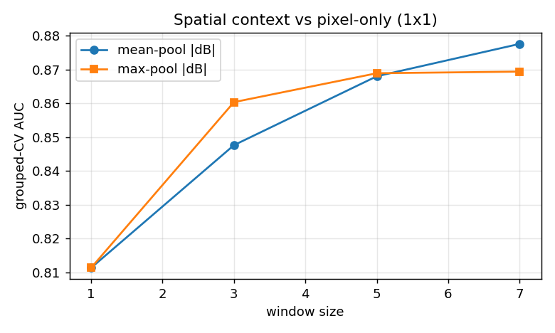
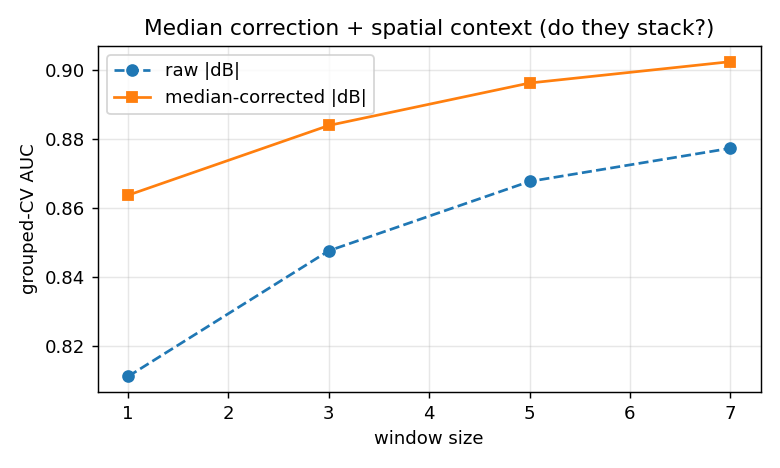

# OSCD Exploratory Data Analysis for Quantum Change Detection

Data-driven EDA for the **Quantum Change Detection in Satellite Earth Observations**
challenge (2026 Niels Bohr Quantum Summer School, SDU Odense).

The task: pixel-level **binary change detection** on multi-temporal Sentinel-2
imagery — flag *urban* growth/structural change (label `255`) while ignoring
natural variation such as seasonal vegetation (label `0`). The end goal is a
**Quantum Machine Learning (QML)** pipeline, where the number of input features
directly costs qubits/parameters. This repository answers the question that
comes *before* modelling:

> **Which features actually carry the change signal, so we can feed a small,
> well-chosen set into a few-qubit circuit?**

All analysis is on the 14 labelled **train** cities. It is fully reproduced by
[`eda.py`](eda.py); numeric outputs are in [`results/RESULTS.md`](results/RESULTS.md).

> 📌 **Writing the poster? Start with
> [`docs/QML_POSTER_README.md`](docs/QML_POSTER_README.md)** — models, encoding,
> parameter counts, training protocol, metrics, full result tables, and the
> wording guards, all in one place.
>
> 📌 **Picking this up cold? Start with [`docs/HANDOFF.md`](docs/HANDOFF.md)** — a
> self-contained state of the project: every design decision and its rationale,
> all measured results, the conclusions that were corrected along the way, how to
> run everything, and the prioritized next steps.

---

## Dataset

**Onera Satellite Change Detection (OSCD)** — Sentinel-2 MSI, Copernicus.

| | |
|---|---|
| Cities | 24 (14 train w/ labels, 10 test w/ hidden labels) |
| Per city | 13 spectral bands × 2 dates (T1, T2), co-registered to 10 m (`imgs_*_rect`) |
| Image size | variable, 385×241 … 1070×1180 |
| Labels | `<city>-cm.tif` change mask |
| Change prevalence | **2.29 %** of pixels (severe imbalance) |

> ⚠️ **Label encoding gotcha:** the `*.tif` rasters encode `{1 = no change,
> 2 = change}`, **not** the `{0, 1}` stated in the dataset README. Verified
> against `cm.png`. Using the README convention silently labels every pixel as
> change. This repo uses `change = (tif == 2)`.

The dataset itself is **not** committed (size + CC-BY-NC-SA / Copernicus terms).
Download it from the [challenge / OSCD source](https://rcdaudt.github.io/oscd/)
and point `--data_dir` at the extracted `OneraDataset` folder.

---

## Method & findings

Normalization is fixed as **per-band robust min-max**: clip to the per-band
1st/99th percentile (estimated on **train, T1+T2 pooled**, then frozen) and
scale to `[0,1]`. Heavy bright tails (clouds/water push maxima to ~10× P99) make
plain min-max crush typical pixels, so robust clipping is used throughout.
Frozen constants: [`results/norm_params.json`](results/norm_params.json).

### Step 0 — Data hygiene & global shift
No-data pixels are negligible (0.01 %). A mild global radiometric shift exists
(T2 ~3–5 % darker, strongest in NIR/Red-Edge) — a change-independent baseline to
keep in mind. AUC (rank-based) is unaffected by it.

### Step 1 — Per-band relevance: `dB` vs `|dB|`


Single-band separability, measured as ROC-AUC (imbalance-robust) of the
temporal difference.

**Direction has no univariate/linear relevance; magnitude is the signal.** For
every band `AUC(signed dB) ≈ 0.5` and a *linear* multivariate probe on signed
`dB` scores only 0.48 — but a *nonlinear* model recovers 0.79 from signed `dB`
(it re-derives the magnitude). Crucially `[dB, |dB|]` does **not** beat `|dB|`
alone (0.80 vs 0.82), so there is no extra directional/joint pattern beyond
magnitude. → **feed `|dB|` explicitly** (spares the model from learning `abs`);
signed `dB` is not information-free, just an inefficient encoding.



Best bands: **B04 (Red) 0.79**, B05 0.77, B03, B02, then SWIR B12/B11. The
atmospheric bands **B09 (water vapour)** and **B10 (cirrus)** are useless here
(AUC ≤ 0.55; B10's `|dB|` is even below chance) — now dropped on *evidence*, not
just physical prior.

### Step 2 — Redundancy: correlation & grouping of `|dB|`


The 13 bands collapse to **~5 independent axes** (|corr| > 0.8):
`{B02,B03,B04}` visible · `{B06,B07,B08,B8A}` NIR/Red-Edge · `{B11,B12}` SWIR ·
`B05` Red-Edge-1 (bridge) · isolated `B01/B09/B10`. Keeping the highest-AUC
representative per group is enough.

### Step 3 — Spectral-index change (counter-intuitive)
NDVI/NDWI/NDBI/NDMIR *changes* are **weaker** (AUC 0.56–0.62) than raw `|dB|`
(0.72–0.79). Normalized-difference indices divide out overall brightness — which
is exactly the magnitude signal we need. → indices are **not** used in the
baseline feature set. "Physically plausible" ≠ "discriminative on this data".

### Step 4 — Intrinsic dimensionality & leakage-free validation



PCA on `|dB|`: PC1 alone explains **59 %**, top-4 reach 85 %. Multivariate AUC
(logistic regression, **GroupKFold by city → no train/test leakage**):

| feature set | AUC |
|---|---|
| all 13 `|dB|` | 0.812 |
| PCA top-4 | **0.822** |
| compact 4 (B04,B05,B12,B08) | 0.805 |
| compact 3 (B04,B05,B12) | 0.808 |
| single `|dB(B04)|` | 0.795 |

**Compressing 13 → 3–4 features loses essentially nothing** (PCA-4 is fit
inside each CV fold — leakage-free). The compact spectral-change ceiling is
~0.82 and it **holds under a nonlinear model and after adding the absolute
`[B_T1, B_T2]` state** (0.81–0.82) — so beating it needs **spatial context**,
not more bands or nonlinearity.

> **Metric caveat:** AUCs above use a class-balanced sample. At the true 2.29 %
> prevalence, report **PR-AUC, F1 and Change-Accuracy** (the challenge metrics) —
> ROC-AUC alone is optimistic under extreme imbalance.

### Part 2 — domain shift, spatial context, hard negatives



- **Per-image median correction** (*per-pair unsupervised radiometric centering*).
  Per-city median `dB` varies enormously (B8A spread ~1500 DN across cities), so
  raw `|dB|` partly encodes *city/season identity*. Subtracting each image's
  median baseline `dBᶜᵒʳʳ = (T2−T1) − median` lifts cross-city AUC
  **0.811 → 0.864**. It uses no labels and — since change is only 2.29 % — the
  median reflects the no-change population, so it is robust. Adopt it.
- **Spatial sweep (mean-pool `|dB|`).** 1×1 **0.811** → 3×3 0.848 → 5×5 0.868 →
  7×7 **0.878**, monotonic. Spatial context is a real, sizeable lever →
  **a spatial model (QCNN / patch features) is justified.**
- **Hard negatives.** Within the top-20 % `|dB|` ("changed a lot"), separating
  *urban* from *natural* change using land-cover state
  `[B_T1, B_T2, NDVI_T1/T2, NDBI_T1/T2]` gives AUC **0.59 under random CV but
  only 0.53 under city-grouped (leave-region-out) CV** — i.e. essentially
  chance across cities. **Pixel spectral state does not generalize as an
  urban-vs-natural discriminator**; that distinction must come from spatial
  *structure*, not spectrum. Hard-negative *sampling* still matters for training,
  but don't expect spectral state features to solve it.

### Part 3 — do median-correction and spatial context stack? (yes)



Mean-pool `|dB|`, grouped CV, raw vs median-corrected:

| window | raw | median-corrected |
|---|---|---|
| 1×1 | 0.811 | 0.864 |
| 3×3 | 0.848 | 0.884 |
| 5×5 | 0.868 | 0.896 |
| 7×7 | 0.877 | **0.902** |

The two levers are **complementary** — the spatial gain survives *after* the
global radiometric shift is removed, so it is genuine local structure, not an
averaged-out illumination artifact. They are only **approximately additive**: the
correction gain shrinks as the window grows (+0.053 at 1×1 → +0.025 at 7×7), but
both remain beneficial when combined. A median-corrected 7×7 linear probe reaches
**0.90**.

Read this as a **classical spatial reference**, not a bar the QML must clear.
Three distinct benchmarks matter:

| benchmark | AUC | role |
|---|---|---|
| **M0** pixel baseline (median-corrected 1×1) | ~0.864 | quantum-baseline target |
| **spatial reference** (median-corrected 7×7, linear) | ~0.902 | upper reference |
| **parameter-matched classical** (same features, ≤ QML params) | TBD | **the real comparison** |

The challenge's own rule compares the QML to a classical model on the *same
features with no more trainable parameters*. So success is a small QML that beats
its **parameter-matched** classical twin while approaching ~0.90 — not necessarily
exceeding the unconstrained 7×7 reference.

---

## Recommendation for the QML pipeline

- **Input features:** per-band robust-normalized, **median-corrected `|dBᶜᵒʳʳ|`**
  from the common 13-band base, reduced to 4 → **4-qubit angle encoding**. A
  follow-up 5-fold city-grouped check settled the representation:
  **PCA-4 = 0.865 ≈ All-13 0.864 > Physical-4 {B04,B05,B12,B08} 0.855** →
  **default main = PCA-4** (signed, `θ=π·u`), Physical-4 (`θ=π·|dB|`) kept as the
  interpretability branch; final call deferred to the spatial VQC. Full data
  pipeline in [`docs/data_pipeline.md`](docs/data_pipeline.md).
- **Angle > amplitude encoding:** PC1 (59 % of variance) is essentially overall
  change *magnitude*; amplitude encoding normalizes `‖x‖` away and would discard
  it. If amplitude is tried, encode `‖x‖` on a separate qubit.
- **Exclude** signed `dB` and spectral-index *deltas*. NDVI/NDBI *state* (T1,T2)
  separated hard negatives weakly under random CV (0.59) but **failed to
  generalize across cities (0.53)** → **not part of the primary input**; retained
  only as an optional ablation.
- **Drop** B01/B09/B10 (low relevance *and* redundant/isolated).
- Parameter-matched classical baseline gets the **same** features.
- Biggest remaining lever is **spatial patches**, not extra bands.

```
raw T1/T2 → robust per-band norm → per-image median-corrected |dB|
          → {B04,B05,B12(,B08)} / PCA-4   (+ optional NDVI/NDBI state)
          → n×n patch → PQC   vs   param-matched MLP
```

---

## Model & data-pipeline design

- **Data pipeline** ([`docs/data_pipeline.md`](docs/data_pipeline.md)): 13-band
  base → Physical-4/PCA-4 branches, representation-independent center pools,
  city-balanced 1:1:2 sampler, `π_pixel = 21.8 %` → plain-BCE decision.
  Implemented in [`data/`](data) (`splits`, `preprocess`, `pools`, `sampler`),
  each with a passing smoke test.
- **Results so far** ([`docs/results_capacity_sweep.md`](docs/results_capacity_sweep.md)):
  M3 capacity sweep 38 → 74 → 110 params. Capacity is a binding constraint at 38
  (micro F1\* 0.189 → 0.302 from L1 to L2) but **saturates beyond ≈74**; it lifts
  every city yet does **not** compress the cross-city spread. A φ=γ·sᵢ·sⱼ diagnostic
  shows the data-dependent ZZ is < 0.1 rad for ~90 % of neighbour pairs, so the
  M1/M2/M3 comparison (the core claim) is the next and still-untested step.
- **Which cities the metrics are on**
  ([`docs/hidden_city_evaluation.md`](docs/hidden_city_evaluation.md)): every
  reported number is over the **14 labelled** cities under leave-city-out CV; the
  10 test cities have no ground truth and are predict-only. Per-city,
  model-vs-model tables are in
  [`docs/results_heldout_city_comparison.md`](docs/results_heldout_city_comparison.md)
  (regenerate: `python train/compare_heldout_cities.py` for the tables,
  `python train/plot_heldout_comparison.py` for
  [`city_split.png`](results/p3_matrix/city_split.png) and
  [`heldout_city_comparison.png`](results/p3_matrix/heldout_city_comparison.png));
  scoring the 10 hidden cities if their labels are released is
  `train/score_hidden_cities.py`.
- **Model ladder** ([`docs/model_ladder.md`](docs/model_ladder.md)): M0 pixel
  baseline → M1/M2/M3 all 38-param (one factor each) → M4 re-uploading, with
  parameter-matched classical twins and the ablation matrix. Main model M3 (9-to-9
  Spatial ZZ Re-uploading VQC) is in
  [`circuits/m3_spatial_zz.py`](circuits/m3_spatial_zz.py); diagram
  [`results/m3_circuit.png`](results/m3_circuit.png).

## Reproduce

```bash
pip install -r requirements.txt
python eda.py --data_dir /path/to/OneraDataset
```

Regenerates every figure in `results/` and `results/RESULTS.md`. Seeded
(`RandomState(0)`) for deterministic sampling.

## Disclosure

Analysis code and this write-up were prepared with assistance from a generative
AI coding assistant (Anthropic Claude). Every numeric result is produced by the
committed [`eda.py`](eda.py) and is independently reproducible from the raw
dataset; findings (e.g. the `{1,2}` label encoding, the `|dB|` vs `dB` result)
were verified against the data rather than taken on assertion.
