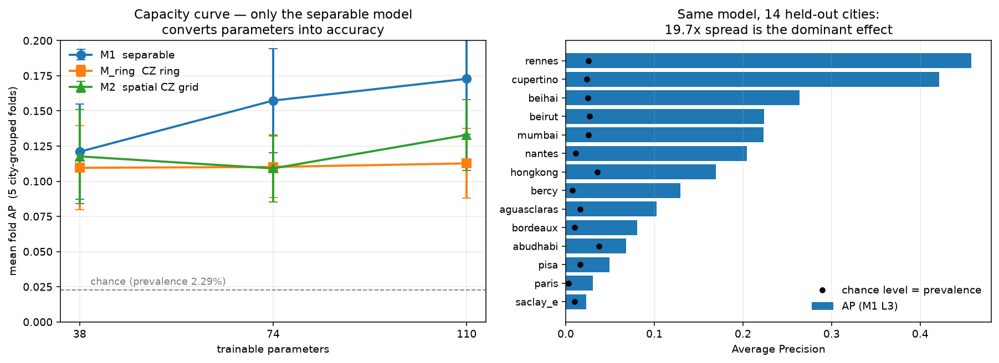

# QML Results — what the model actually does

Plain-language summary of the quantum side. Numbers come from one harness
(`train/run_cell.py`, 45 cells) under 5-fold city-grouped CV; raw values in
[`../results/p3_matrix/matrix.csv`](../results/p3_matrix/matrix.csv).

**All metrics below are over the 14 labelled cities, each held out in full
exactly once.** The 10 OSCD test cities have no ground truth, so nothing can be
scored on them here — they get predicted masks only (§5). Per-city model-vs-model
tables: [`results_heldout_city_comparison.md`](results_heldout_city_comparison.md).
What scoring the 10 would require: [`hidden_city_evaluation.md`](hidden_city_evaluation.md).

---

## 1. What the model is

For every pixel it looks at a **3×3 neighbourhood**, takes **4 numbers per pixel**
(PCA of the median-corrected 13-band change magnitude), puts **one pixel on one
qubit**, and outputs the probability that the **centre pixel** is urban change.

```
3×3×4  →  9 qubits  →  ⟨Z⟩ on all nine  →  p = σ(a·mean⟨Z⟩ + b)
```

Sliding this over a city with stride 1 gives the full change mask. The largest
model has **110 trainable parameters** — roughly the size of a single small
convolution kernel.

---

## 2. Is it any good? — the honest answer

**It finds real signal, but it is far from a usable map on its own.**

At the submission operating point (M1 L3, τ = 0.581), per **1,000,000 pixels**:

| | pixels |
|---|---|
| actually changed | 22,900 |
| model flags as changed | 50,229 |
| ├ correct (true positives) | **7,283** |
| └ false alarms | **42,946** |
| missed changes | 15,617 |

So: **precision ≈ 14.5 %** (of the pixels it flags, ~1 in 7 is real) and
**recall ≈ 32 %** (it catches about a third of the real changes).

Why this is nonetheless a real result: change is only **2.29 %** of pixels, so a
coin flip would score AP = 0.023. The model scores **AP = 0.110** pooled
out-of-fold — a **4.8× lift over chance**. Its ranking ability is decent
(ROC-AUC 0.81–0.84); what it lacks is the sharpness to convert that ranking into
a clean binary mask at this extreme class imbalance.

| metric | pooled OOF | macro over 14 cities |
|---|---|---|
| **AP** (primary) | 0.1096 | 0.1748 |
| ROC-AUC | 0.8137 | 0.8374 |
| F1\* | 0.1990 | 0.2406 |
| Change-Accuracy (recall) | 0.316 | 0.338 |
| No-change-Accuracy | 0.956 | 0.968 |
| Accuracy | 0.942 | 0.956 |

> **Do not read Accuracy as success.** At 2.29 % prevalence, predicting "no
> change" everywhere already scores 97.7 %. F1 and Change-Accuracy are the
> meaningful numbers. F1\* also picks its threshold on the same pixels it scores,
> so it is a best-case operating point, not an unbiased test number.

**For scale:** the EDA's *classical* reference on the same data — a plain linear
probe on all 13 median-corrected bands — reaches ROC-AUC ≈ 0.864 pixel-wise and
≈ 0.902 with 7×7 spatial pooling. A 110-parameter quantum circuit landing at
ROC-AUC ≈ 0.84 is in the same neighbourhood, but it has not beaten the
unconstrained classical probe.

---

## 3. The three findings



### (a) Adding entanglement did not help — at any depth, in either topology

Paired per-fold differences against M1 (identical folds, identical
initialisation, identical training patch stream — the entangler is the only
difference):

| | 38 params | 74 params | 110 params |
|---|---|---|---|
| M_ring (CZ ring) − M1 | −0.0114 (0/5 wins) | −0.0472 (0/5) | −0.0601 (0/5) |
| M2 (spatial CZ grid) − M1 | −0.0033 (1/5) | −0.0482 (0/5) | −0.0399 (1/5) |

Entangled variants lose in **28 of 30** paired fold comparisons, and they are
also worse on the *training* objective (final BCE: M1 0.430 vs M_ring 0.450 vs
M2 0.448 at L3), so this is not a case of trading fit for generalization — both
axes get worse. The entanglers do produce genuine inter-pixel interaction
(verified before training: `|I_ij| ~ 10⁻²` vs M1's `10⁻¹⁶`), so "the entangler
did nothing" is ruled out by construction.

### (b) Only the separable model turns parameters into accuracy

Mean fold AP as capacity grows 38 → 74 → 110:

| | 38p | 74p | 110p | total gain |
|---|---|---|---|---|
| **M1 separable** | 0.1210 | 0.1573 | **0.1728** | **+0.052** |
| M_ring CZ ring | 0.1095 | 0.1102 | 0.1127 | +0.003 |
| M2 spatial grid | 0.1177 | 0.1091 | 0.1329 | +0.015 |

M1 improves ~43 %; the ring is essentially flat. The gap widens from 0.012 at
38p to 0.060 at 110p — **more capacity makes the entangled models relatively
worse, not better.** (This is read from the centre-branch matrix alone; the
earlier dense-branch 74→110 plateau is a different architecture and is not used
as a prior here.)

### (c) Which city you test on matters far more than which circuit you use

Same model, 14 held-out cities: AP ranges **0.026 (saclay_e) to 0.446 (rennes)** —
a **17× spread**, an order of magnitude larger than any architecture difference.
This is the same cross-city difficulty the EDA found at the very start (land-cover
features separating urban from natural change scored 0.59 under random CV but
0.53 — chance — under city-grouped CV).

**Practical implication:** the binding constraint is domain shift between cities,
not the quantum circuit design.

---

## 4. What this supports — and what it does not

**Supported:**
- A 110-parameter quantum circuit extracts real change signal (4.8× over chance)
  from a 3×3 spectral-change patch.
- Under matched parameter budgets, adding a fixed CZ entangler — ring or
  spatially aligned grid — did **not** improve cross-city generalization in this
  setup, at 38, 74 or 110 parameters.
- The separable circuit alone benefited from added capacity.

**Not supported / out of scope:**
- Any claim of quantum advantage. The parameter-matched classical comparison
  (37-param 3×3 conv) is still outstanding.
- "Entanglement is useless." Two fixed entanglers, one encoding, one readout, one
  task, one seed per fold. Trainable or data-adaptive couplings were not tested
  here (the M3 IsingZZ variant is near-identity for ~90 % of neighbour pairs as
  configured, so it has not had a fair test).
- Topology conclusions from M_ring vs M2: the ring shares 6 of its 9 edges with
  real horizontal neighbours and uses 9 gates/stage against the grid's 12, so it
  is an architecture-sensitivity control, not a topology-only control.

**Statistics caveat:** 5 folds, and cities within a fold share a trained model,
so the 14 cities are not independent samples. Differences are reported as paired
per-fold values and win counts; no p-values are computed.

---

## 5. The submitted model

**M1, depth 3, 110 parameters**, chosen on AP (it leads every aggregation).

1. τ\* = 0.5808 from pooled out-of-fold predictions over all 6,516,692 labelled
   pixels, then frozen.
2. Retrained on all 14 labelled cities (final train BCE 0.4327).
3. Predicted the 10 hidden cities → uint8 `{0,255}` PNG masks.

Threshold transfer checks out: the OOF operating point implies a 4.99 % positive
rate and the test masks average 5.19 %.
