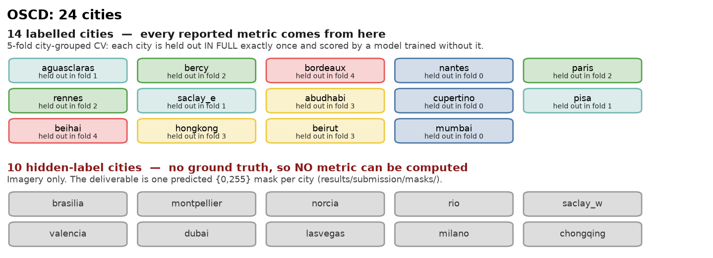
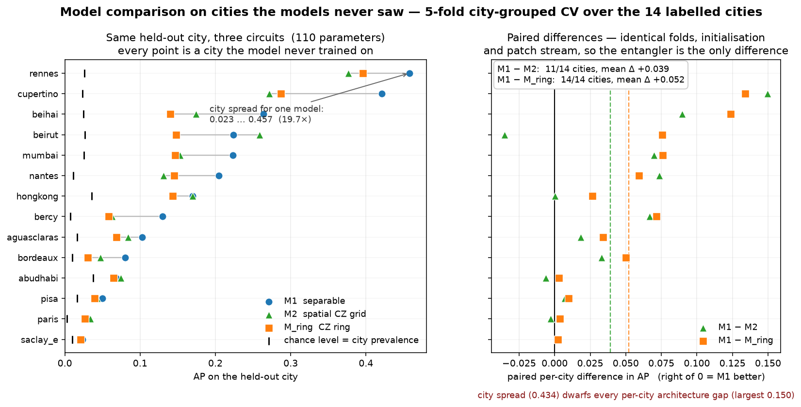

# Evaluating on the 10 hidden cities — what is possible, and what it costs

Raised in review: *"the 5-fold CV is over the training cities only — isn't the
point of the 10 validation cities to compare the two models on them? The results
section only reports the 14."*

Both halves of the observation are correct. This note says what the repo can and
cannot do about it, and what each option needs.

---

## 1. The split, precisely



| | cities | labels | role here |
|---|---|---|---|
| train | 14 | yes | transform fitting, training, 5-fold city-grouped CV, threshold choice |
| test | 10 | **no** | predict-only — the deliverable is one mask per city |

`data/splits.py` is the single source of truth: `TEST_CITIES` is commented
*"hidden-label test cities (used only in final mode, predict-only)"*, and
`submit/final_pipeline.py` reaches them through `dcorr13_unlabeled()`, a
label-free path that takes the raster shape from the imagery because there is no
mask to take it from.

So no accuracy number for the 10 cities can be produced from what this repo has.
What exists for them is the deliverable and its sanity check:

- 10 uint8 `{0,255}` PNG masks (`results/submission/masks/`)
- per-city predicted change fraction (`results/submission/predict_m1_L3.json`)
- a threshold-transfer check: the frozen out-of-fold operating point implies a
  4.99 % positive rate, the test masks average 5.19 %

That check confirms τ carried over without mis-scaling. It is **not** an accuracy
measurement — it never sees a label.

## 2. What the 14-city protocol already gives you

The 5-fold CV is **city-grouped**, not a random pixel split: each of the 14
labelled cities is held out in full exactly once and scored by a model trained
without it. So every number in the results section is already a *leave-city-out*
number — the same kind of cross-city generalization test the 10 hidden cities
would provide, with 14 held-out cities instead of 10, and with matched pairing
across architectures (same folds, same init, same patch stream).



*Left: the same held-out city scored by all three circuits. Right: the paired
per-city difference against M1 — dashed lines are the means. Every point is a
city that model never trained on.*

[`results_heldout_city_comparison.md`](results_heldout_city_comparison.md) is
that comparison written out per city — M1 vs M2 vs M_ring, one row per held-out
city, with paired differences and win counts. Regenerate both with:

```bash
python train/compare_heldout_cities.py            # tables,  no dataset, no GPU, ~1 s
python train/plot_heldout_comparison.py           # figures, no dataset, no GPU, ~2 s
```

At L3 (110 params) it reports M1 ahead on macro AP 0.1748 vs 0.1358 (M2) and
0.1226 (M_ring), winning 11/14 and 14/14 held-out cities respectively — while the
city-to-city spread for a single model is 0.023…0.458, about 20×. The binding
constraint is which city you test on, not which circuit you use.

## 3. If the test labels become available

`train/score_hidden_cities.py` produces the same table for the 10 cities:

```bash
python train/score_hidden_cities.py \
    --label_root /path/to/test_labels \
    --pred "M1 L3=results/submission/masks"
```

It searches `--label_root` recursively for `<city>/cm/<city>-cm.tif` (and the
PNG/flat variants), decodes `{1 = no change, 2 = change}` exactly as
`preprocess._load_label` does, crops predictions and labels to their common
extent, and writes `results/submission/hidden_city_scores.json` plus
`docs/results_hidden_cities.md`.

**τ is frozen.** The default operating point is `tau_final` from
`results/submission/threshold_m1_L3.json`, chosen out-of-fold before any test
city was touched; the script has no code path that selects a threshold on test
pixels.

### Two granularities, and why it matters

| input | metrics recoverable |
|---|---|
| `<city>_prob.npz` (probability map) | everything, including **AP** (primary) and ROC-AUC |
| `<city>.png` (the committed `{0,255}` mask) | F1 / precision / Change-Accuracy at the frozen τ only |

The masks are already thresholded, so AP and ROC-AUC cannot be reconstructed from
them and are reported as `n/a` rather than computed from a binary vector (which
would silently return the operating point dressed up as a ranking metric). The
probability maps are covered by `.gitignore` (`*.npz`) and are **not** in the
repo — they exist only on the machine that ran the pipeline. If that machine
still has `results/submission/masks/*_prob.npz`, point `--pred` at it and the full
table comes out in under a minute with no recomputation.

### Comparing architectures on the 10 cities

Only M1 L3 was ever trained on all 14 and run over the test cities, so a
model-vs-model comparison there needs the comparison architecture put through the
same two stages. `--tau` carries the frozen M1 operating point over to a model
that has no out-of-fold threshold file of its own, and masks now land in
`masks_<kind>_L<depth>/` so nothing overwrites the frozen submission:

```bash
python submit/final_pipeline.py train   --kind m2 --depth 3 --data_dir /path/to/OneraDataset
python submit/final_pipeline.py predict --kind m2 --depth 3 --data_dir /path/to/OneraDataset \
       --tau 0.5808
python train/score_hidden_cities.py --label_root /path/to/test_labels \
    --pred "M1 L3=results/submission/masks_m1_L3" \
    --pred "M2 L3=results/submission/masks_m2_L3"
```

## 4. Cost

Measured from the committed run records (`results/submission/final_m1_L3.json`,
`predict_m1_L3.json`, `results/runs/p3_topology/*_fold*.json`) on the machine that
produced them; the entangled circuits are scaled by their per-fold time ratio
against M1 (M2 ×1.31, M_ring ×1.22).

| stage | M1 L3 | M2 L3 | M_ring L3 |
|---|---|---|---|
| final train, 14 cities, 50 epochs | 35 min (measured) | ~46 min | ~43 min |
| predict 10 cities, stride-1 | 52 min (measured) | ~68 min | ~63 min |
| **per model** | **~1.5 h** | **~1.9 h** | **~1.8 h** |

Scoring itself is under a minute. Three models end to end is ~5 h sequentially,
or ~2 h if the three are run as separate processes. M1 has to be re-run too: its
weights (`results/submission/*_model.npz`) and probability maps are gitignored and
absent from the repo.

Doing this at every depth instead of L3 only would be 9 models, ~15 h sequential —
not worth it: depth is already covered by the capacity sweep on the 14 cities.

## 5. One discipline point

The submitted model was selected on out-of-fold AP over the 14 labelled cities and
is frozen. If test-city scores arrive, report them as a final evaluation — do not
re-pick the architecture, depth or threshold on them. Selecting on the test
cities would turn the only unbiased number in the project into another validation
number, and the poster's claims are all stated against the CV protocol.
