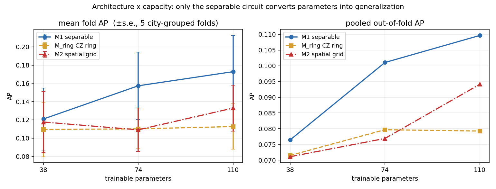

# P3 — architecture × capacity: entangler structure vs trainable-parameter budget

Complete 3 × 3 ablation. **45 cells** (3 architectures × 3 depths × 5 city-grouped
folds), all produced by **one harness** ([`train/run_cell.py`](../train/run_cell.py)),
so the matrix is internally consistent. Aggregated by
[`train/report_p3.py`](../train/report_p3.py); machine-readable output in
[`../results/p3_matrix/`](../results/p3_matrix) (`matrix.json`, `matrix.csv`).

## The three architectures

Identical in every respect — input `3×3×4` (PCA-4 per pixel), 9 qubits, encoding,
trainable single-qubit mixers, untied data re-uploading, `center_mean` readout
`p = σ(a·mean_q⟨Z_q⟩ + b)`, loss, optimizer, sampler, CV protocol — **except the
entangler**, which is fixed and non-trainable in all cases:

| | entangler | CZ per stage |
|---|---|---|
| **M1** | none (separable) | 0 |
| **M_ring** | CZ ring `(0,1)(1,2)…(7,8)(8,0)` | 9 |
| **M2** | CZ on the 12 spatial nearest-neighbour edges | 12 |

Parameters `36L + 2` → **38 / 74 / 110** at L1 / L2 / L3, identical across all
three (CZ is non-trainable). Verified from the executed tape: 2 / 4 / 6
entangling stages at L1 / L2 / L3, each a complete edge set.

> **Wording guard.** M_ring is a **CZ ring-entangled HEA-style control**, not a
> geometry-agnostic or topology-only control: on a 3×3 raster layout 6 of its 9
> edges coincide with real horizontal spatial neighbours, and 9 ≠ 12 gates. An
> M_ring vs M2 difference must **not** be read as a pure topology effect.

## Result — mean fold AP (std), 5 city-grouped folds

| | L1 · 38p | L2 · 74p | L3 · 110p |
|---|---|---|---|
| **M1 separable** | **0.1210** (0.076) | **0.1573** (0.083) | **0.1728** (0.089) |
| M_ring CZ ring | 0.1095 (0.067) | 0.1102 (0.049) | 0.1127 (0.055) |
| M2 spatial grid | 0.1177 (0.075) | 0.1091 (0.053) | 0.1329 (0.056) |

### Paired differences vs M1 (same folds, same init, same patch stream)

| depth | model | ΔAP per fold | mean | wins |
|---|---|---|---|---|
| L1 | M_ring | −0.027, −0.002, −0.015, −0.012, −0.001 | **−0.0114** | 0/5 |
| L1 | M2 | −0.007, −0.001, +0.005, −0.005, −0.008 | −0.0033 | 1/5 |
| L2 | M_ring | −0.114, −0.007, −0.044, −0.052, −0.019 | **−0.0472** | 0/5 |
| L2 | M2 | −0.097, −0.004, −0.059, −0.058, −0.023 | −0.0482 | 0/5 |
| L3 | M_ring | −0.104, −0.008, −0.030, −0.037, −0.122 | **−0.0601** | 0/5 |
| L3 | M2 | −0.108, −0.006, −0.026, +0.021, −0.080 | −0.0399 | 1/5 |

M1 wins **13 of 15** paired fold comparisons. No p-values: 5 folds cannot reach
p<0.05, and the 14 cities inside them share models, so they are not independent.

## The main finding

**Only the separable circuit converts extra parameters into generalization.**

| architecture | L1 → L3 | Δ(1→2) | Δ(2→3) |
|---|---|---|---|
| **M1** | 0.1210 → **0.1728** | +0.0364 | +0.0155 |
| M_ring | 0.1095 → 0.1127 | +0.0006 | +0.0025 |
| M2 | 0.1177 → 0.1329 | −0.0085 | +0.0238 |

M1 gains **+0.052** across the budget; the ring gains **+0.003** — essentially
flat — and the grid **+0.015**, non-monotonically (it *drops* from L1 to L2). The
gap to M1 therefore *widens* with capacity: −0.011 at 38p → −0.060 at 110p for
the ring. Adding a fixed entangler does not merely fail to help; under this
protocol it appears to absorb capacity that the separable model turns into
held-out performance.

**The fit axis agrees** — this is not a case of extra fitting power failing to
generalize; both axes favour M1:

| final train BCE | L1 | L2 | L3 |
|---|---|---|---|
| M1 | **0.4665** | **0.4358** | **0.4299** |
| M_ring | 0.4754 | 0.4519 | 0.4502 |
| M2 | 0.4745 | 0.4507 | 0.4479 |

**Every aggregation agrees.** Macro over the 14 held-out cities: M1 L3 is best on
AP (0.1748), ROC-AUC (0.837) and F1\* (0.241). Pooled out-of-fold (one global τ\*,
every labelled pixel exactly once): M1 L3 best on AP (0.1096) and F1\* (0.199).

### Challenge metrics — macro over the 14 held-out cities

| cell | AP | ROC-AUC | F1\* | ChangeAcc | NoChangeAcc | Accuracy |
|---|---|---|---|---|---|---|
| **m1_L3** | **0.1748** | **0.8374** | **0.2406** | 0.3378 | 0.9683 | 0.9564 |
| m1_L2 | 0.1616 | 0.8355 | 0.2309 | 0.3440 | 0.9648 | 0.9529 |
| m1_L1 | 0.1419 | 0.8058 | 0.1994 | 0.3469 | 0.9262 | 0.9147 |
| m2_L3 | 0.1358 | 0.8311 | 0.2014 | 0.3250 | 0.9608 | 0.9494 |
| m2_L1 | 0.1276 | 0.8000 | 0.1877 | 0.3189 | 0.9498 | 0.9378 |
| mring_L3 | 0.1226 | 0.8264 | 0.1855 | 0.3459 | 0.9472 | 0.9364 |
| mring_L1 | 0.1220 | 0.8034 | 0.1813 | 0.3618 | 0.9170 | 0.9061 |
| m2_L2 | 0.1182 | 0.8223 | 0.1858 | 0.3343 | 0.9533 | 0.9416 |
| mring_L2 | 0.1145 | 0.8229 | 0.1824 | 0.3441 | 0.9432 | 0.9327 |

F1\*, ChangeAcc and NoChangeAcc sweep their threshold on the very predictions
they score — best-operating-point diagnostics, not unbiased test values. AP is
the primary metric. Note that the entangled circuits sometimes post a *higher*
ChangeAcc (mring_L3 pooled 0.463) purely because their τ\* lands lower; their AP
and F1\* are still worse.

## Reproduction cross-check — and one discrepancy

Re-running M1 at L1 in this harness reproduced **P0 exactly**: fold APs
0.2519 / 0.0224 / 0.1299 / 0.1222 / 0.0784 and the per-epoch train BCE to four
decimals. Same folds, same init, same patch stream.

**M1 at L2 did not reproduce the separately-run P2 numbers.** Fold-mean is close
(0.1573 here vs 0.1603 reported) but per-city differences reach 0.06:

| city | this harness | P2 report | Δ |
|---|---|---|---|
| beirut | 0.2726 | 0.2119 | +0.061 |
| hongkong | 0.1468 | 0.2062 | −0.059 |
| cupertino | 0.3954 | 0.4442 | −0.049 |
| **bordeaux** | 0.0848 | 0.0848 | **0.0000** |
| **beihai** | 0.1517 | 0.1517 | **0.0000** |

Fold 4 (bordeaux, beihai) matches to four decimals while folds 0–3 all differ —
too exact to be coincidence, so the two runs agree on one fold and diverge on the
others. The cause is not identified; the readout used by that run was never
confirmed. **Because of this, the matrix above uses only cells from this
harness**, and the P0/P2 artefacts are kept untouched for reference rather than
merged into it.

## What this supports — and what it does not

Supported, for the tested ansatz family and regime:

> Under a matched trainable-parameter budget, adding a fixed entangler — either a
> CZ ring or a spatially aligned CZ grid — did not improve cross-city
> generalization for this task at 38, 74 or 110 parameters, and the separable
> circuit was the only one whose performance scaled with the budget.

Not supported, and not claimed: quantum advantage; "entanglement is useless";
"spatial entanglement is universally harmful"; any pure-topology or
geometry-agnostic interpretation of the ring; any significance claim.

Scope limits: one gate family (CZ), fixed non-trainable entanglers, one encoding
(PCA-4), one readout, one seed per cell, 3×3 patches, five folds. Trainable or
data-dependent couplings were not tested here (M3's data-dependent ZZ was
separately found to sit near identity for ~90 % of neighbour pairs, so it has
never had a fair test). The L3 reading is based on this centre-only matrix alone
and does **not** import the older dense-branch 74→110 plateau as a prior.
